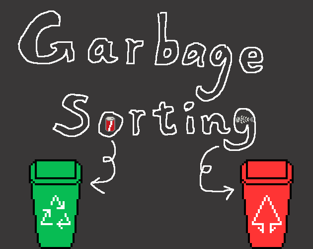
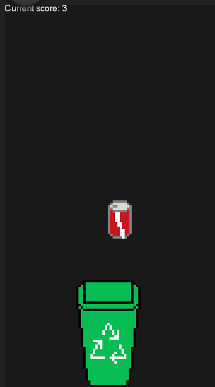

This project created in [itch.io - Low Effort Jam 20](https://itch.io/jam/low-effort-jam-19/rate/1401224) for the theme `garbage`

# GarbageSortingGame

## Controls:
- <b>A/D</b> or <b>Left/Right</b> to move sideways
- <b>Space</b> to switch bin between recycle/unrecycle.

## Gameplay:
The aim is to catch the falling garbage as much as possible in the correct sorting. As time goes on, the garbage and bin get faster and faster.

## Installation:
[Online play](https://hundun.itch.io/garbage-sorting)

## Source/Build:
The game was made with [libGDX](https://libgdx.com/).

------

